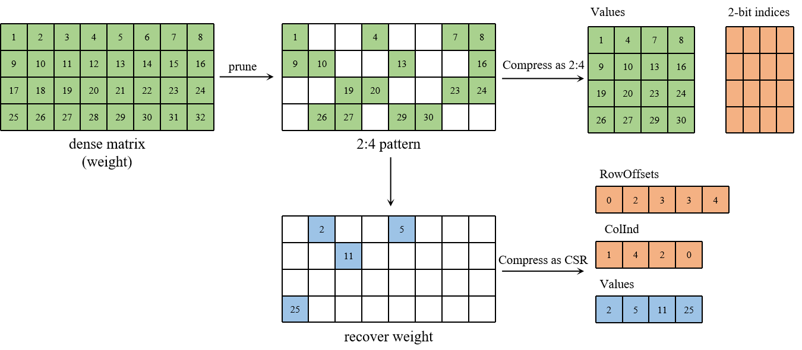

# WRP: Weight Recover Prune for Structured Sparsity

PyTorch implementation of Weight Recover Prune (WRP).

WRP enhances the model performance associated with the 2:4 pattern by recovering a minimal set of crucial weights, thereby ensuring the efficiency of model compression.


## Dependencies

pytorch >= 2.0.0

transformers == 4.36.2

## Usage
### Fake pruning
Fake pruning refers to setting the corresponding values to zero without sparse computation. It is mainly used to validate the perplexity of the model.


```
python main.py \
--model $model_path \
--dataset pajama \
--sparsity_ratio 0.5 \
--sparsity_type 2:4 \
--log result.csv \
--recover \
--alpha 0.25 
```

The meaning of the arguments are as follows:

- model: Model path of LLAMA2 or OPT.
- dataset: Calibration data for algorithms. Followed by [SpQR](https://github.com/Vahe1994/SpQR), we recommend use pajama for LLAMA2 and c4 for OPT.
- sparsity_ratio and type: We focus on enhancing the model performance associated with the 2:4 pattern. As a result, we set sparsity ratio as 0.5 and sparsity type as 2:4.
- log: The file to store the results. The log files are saved in ` ./log/$file_name`. 
- recover: Whether to use WRP to enhance the model performance.
- alpha: The value of recover ratio factor ranges from 0-1.

### Prune and Compress

To verify the compression effect of the model, the following command can be used: 

    python main.py \
    --model $model \
    --dataset pajama \
    --sparsity_ratio 0.5 \
    --sparsity_type 2:4 \
    --log result.csv \
    --recover \
    --alpha 0.25 \
    --compress \
    --save_model $save_path

Here are two additional arguments:

- compress: Whether to use sparse and compress.
- save_model: The path of the compressed models to be saved.

Currently, we only support the compression and saving of the OPT models.

### Block Recover

To verify the effect of block recovery, the following command can be used: 

```
python main.py \
--model $model \
--dataset pajama \
--sparsity_ratio 0.5 \
--sparsity_type 2:4 \
--log result.csv \
--recover \
--recover_format "block_ELL" \
--blocksize 64 \
--topn 8
```

Save arguments are different from the above content:

- recover_format: Whether to use Blocked-ELL data format, default value is CSR.
- blocksize: The block size for matrix. We recommend set the block size as a power of 2.
- topn: The number of blocks to be recovered in each row after tiling.

The density of recovered matrix should be calculated as:
$$
density=\frac{args.topn}{hidden\_state * args.blocksize}
$$
Blocked-ELL also support compression to verify the model size by simply adding `--compress` argument.

We provide the command script at: `./script/` and some logs at `./logs/`.
### Kernel Test

We provide blocked-ELL and CSR data format SpMM kernel using cuSparse library. 

To install the kernel:

```
cd ./kernel/blockELLSpmm
python setup_cuda.py install
#test the correctness of SpMM
python testSpmm.py
```

To test the time of SpMM:

```
cd ./kernel/pytorch_sparse
python test_csr.py
python test_blockELL.py
python test_semi.py
```


### Acknowledgement
This repository is build upon the [Wanda](https://github.com/locuslab/wanda) and [SpQR](https://github.com/Vahe1994/SpQR) repositories.
